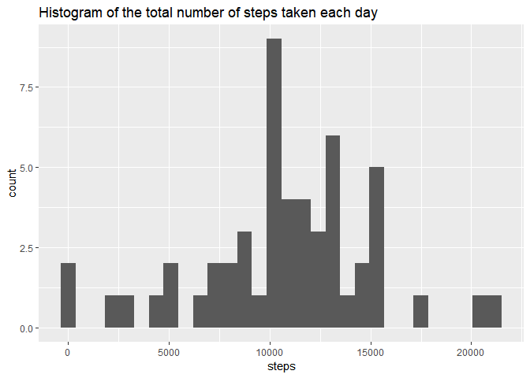
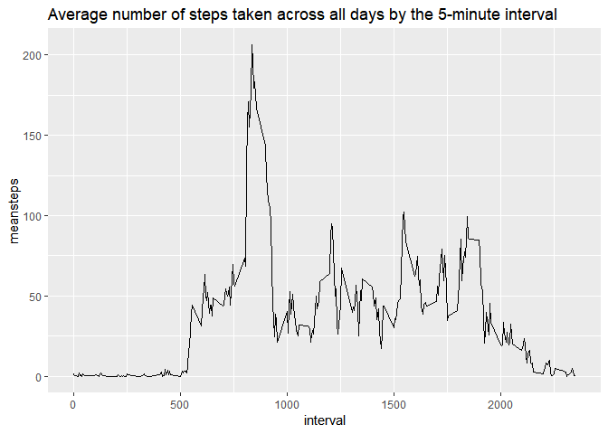
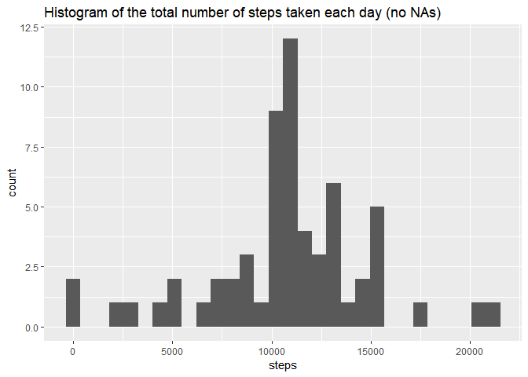
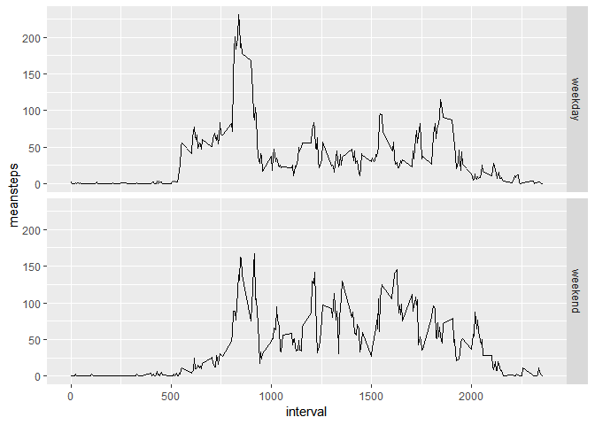

## Loading and preprocessing the data

The data is load using readr package. Using the read_cvs fuction avoids unzip the data.


```r
library(readr)
data<-read_csv("activity.zip")
```


## What is mean total number of steps taken per day

To calculate the number of steps per day, the NAs were filtered using the filter function from the dplyr package.
Adittionaly, the mean and the median are calculated by the summary function.


```r
library(dplyr)
library(tidyr)
library(ggplot2)

stepsperday<- data %>% 
        filter(!is.na(steps)) %>%
        group_by(date) %>%
        summarise(steps=sum(steps))
        
ggplot(stepsperday, aes(x=steps)) +
        geom_histogram() +
        ggtitle("Histogram of the total number of steps taken each day")
```

<!-- -->

The mean and median are calculated by their respective fuctions.


```r
#Mean value
mean(stepsperday$steps)
```

```
## [1] 10766.19
```

```r
#Median value
median(stepsperday$steps)
```

```
## [1] 10765
```

## What is the average daily activity pattern?

Fistly, a new dataframe is created, which has the mean for every 5-minute interval. Then, the line graph is created.


```r
stepsperint<- data %>% 
        group_by(interval) %>%
        summarise(meansteps=mean(steps, na.rm=TRUE))
        
ggplot(stepsperint, aes(x=interval, y=meansteps)) +
        geom_line() +
        ggtitle("Average number of steps taken across all days by the 5-minute interval")
```

<!-- -->

5-minute interval that contains the maximum number of steps (on average across all the days in the dataset)


```r
stepsperint$interval[stepsperint$meansteps==max(stepsperint$meansteps)]
```

```
[1] 835
```

## Imputing missing values

Number of missing values (NAs)


```r
sum(is.na(data$steps))
```

```
[1] 2304
```

A new column which contains the mean of the steps per interval is added to the dataset. Then, the NAs are replaced with that value.


```r
#Creating the new dataframe without NAs

datanona<-left_join(data,stepsperint)

datanona[is.na(datanona$steps),"stepsnona"]<-datanona[is.na(datanona$steps),"meansteps"]

datanona[!is.na(datanona$steps),"stepsnona"]<-datanona[!is.na(datanona$steps),"steps"]

datanona<- datanona %>% select(steps=stepsnona, date, interval)

#Total steps by day dataframe
stepsperdaynona<- datanona %>% 
        filter(!is.na(steps)) %>%
        group_by(date) %>%
        summarise(steps=sum(steps))
        
#Creating graph

ggplot(stepsperdaynona, aes(x=steps)) +
        geom_histogram() +
        ggtitle("Histogram of the total number of steps taken each day (no NAs)")
```

<!-- -->

The mean and median are calculated by their respective fuctions.


```r
#Mean value
mean(stepsperdaynona$steps)
```

```
## [1] 10766.19
```

```r
#Median value
median(stepsperdaynona$steps)
```

```
## [1] 10766.19
```


Comparing to the initial values (with NAs) the mean is the same, however, the median changed and become equal to the mean.

## Are there differences in activity patterns between weekdays and weekends?

The lubridate package is used to add the number of the day. That number is replaced with "weekday" or "weekend".


```r
library(lubridate)
datanona$daytype<-wday(datanona$date)

datanona[datanona$daytype %in% c(2,3,4,5,6),"daytype"]<-"weekday"
datanona[datanona$daytype %in% c(1,7),"daytype"]<-"weekend"

datanona$daytype<-as.factor(datanona$daytype)

stepsbyintday<- datanona %>% group_by(interval,daytype) %>%
                    summarise(meansteps=mean(steps))

ggplot(stepsbyintday, aes(x=interval,y=meansteps)) +
      geom_line() +
      facet_grid(daytype~.)
```

<!-- -->

